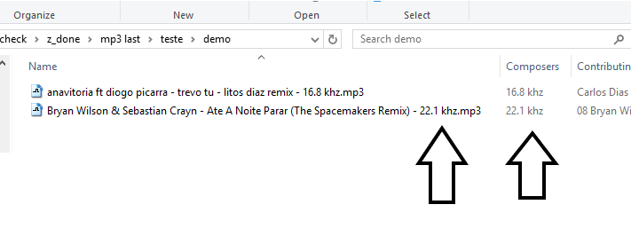

# summary

This program extends fakeflac (http://www.maurits.vdschee.nl/fakeflac/) with two features:
* tagging the mp3/mp4 cutoff as metadata
* same, but renaminig the filename itself

These features  makes it easy to quyickly check for fake flacs inside Windows explorer / MacOS finder:
https://linuxhint.com/install_ubuntu_windows_10_wsl/

example:

# installation

* Running linux nativelly inside windows 10: https://linuxhint.com/install_ubuntu_windows_10_wsl/
* sudo apt-get install sndfile-programs python-scipy python-matplotlib ffmpeg

# alternatives

If you want a manual GUI, I recommend http://spek.cc/

If you an automatic GUI, I recommend https://fakinthefunk.net/en/

The difference of these tools is that they don't tag the files for inspection in Explorer / Finder

